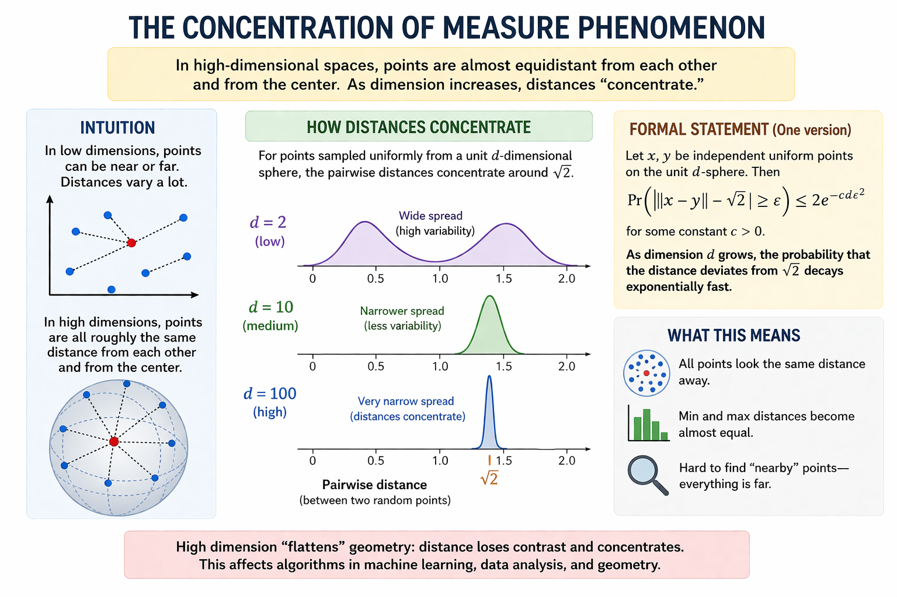

--- 
layout: homepage
---

# About Me

I am an incoming Ph.D. student in Computer Science at the University of Virginia, advised by [Prof. Ferdinando Fioretto](https://nandofioretto.github.io/) as part of the **Responsible AI for Science and Engineering (RAISE)** group. I hold a B.Sc. in Mathematics from Beloit College.

My research focuses on **constraint-driven approaches to reliable AI**, especially in multimodal settings. I am interested in how geometric, physical, and logical structure can be built into models so that their outputs are more consistent, interpretable, and robust. More broadly, I think of this as studying how to make modern AI systems reason in ways that better reflect the structure of the real world.

I am also interested in collaborative and open-sourced AI research, and I’m always happy to connect with others working on related problems.

## Research Interests

I work on reasoning and alignment in multimodal models, with an emphasis on adding structure and constraints into learning and decision-making.

1. **Geometry- and Physics-Informed Reasoning**  
   I study how to enforce geometric, physical, and causal constraints during training so that models produce outputs that are consistent and physically plausible. The goal is to move toward reasoning that is more structured and traceable, rather than purely statistical.

2. **Constraint-Aware Optimization and Reinforcement Learning**  
   I develop optimization and reinforcement learning methods that place constraints directly into training. This helps improve reliability while also reducing unnecessary computational cost.

3. **Decision-Making in High-Stakes Settings**  
   I am interested in applying these ideas to real-world humanitarian problems where reliability matters, such as geospatial coordination, rural logistics, and crisis response. These settings provide a way to evaluate how well models behave under real and emergent constraints.

## News

- **[Aug. 2026]** Starting my Ph.D. in Computer Science at the University of Virginia as part of the RAISE group!

## Publications

1. **Le, Vu Anh** and Dik, Mehmet, “A Mathematical Analysis of Neural Operator Behaviors,” Chapter 23 in *[Advances in Quantum Calculus and Functional Analysis](https://www.routledge.com/Quantum-Calculus-and-Functional-Analysis-with-Applications/Hazarika-Tikare-Dik-Chalishajar/p/book/9781041014478)*, Taylor & Francis Group, July 2025.

2. **Le, Vu Anh**, Nguyen, Dinh Duc Nha, Nguyen, Phi Long, and Sood, Keshav, “RN-F: A Novel Approach for Mitigating Contaminated Data in Large Language Models,” in *[International Conference on Machine Learning Workshop on Data in Generative Models](https://openreview.net/forum?id=XtsXFe5EyX)*, June 2025.

## A fun fact 

  

Why studying geometry is fundamental to the advances of multimodal AI? Let's consider this fun fact. In high-dimensional spaces, distances between points become nearly similar. This reshapes how similarity and structure should be interpreted in learned representations. This phenomenon, named Concentration of Measure, is important to data geometry in AGI because it explains why naive notions of distance fail. That's why it motivates the need for structured, constraint-aware representations that preserve meaningful variation.

## Outside of work

  

Outside of work, I am an avid reader of history and philosophy. I am exploring how diverse schools of thought can inform the design of aligned, augmented AI systems. I see common ground between Western analytic philosophy (with its naturalist worldview) and Taoism (with its concept of Ziran, or natural spontaneity). Though often viewed as opposites, both offer an observational, dissecting approach to learning from experience. I hope to enforce these principles and insights into long‑term scientific AI systems.
