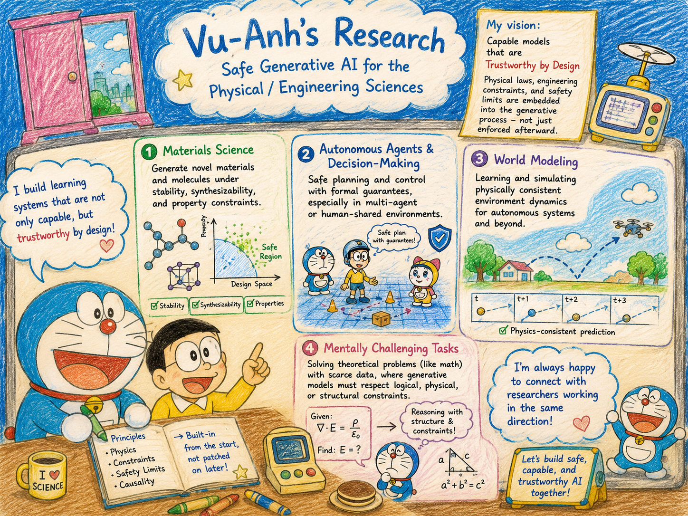

# About Me

Greetings!

I'm a Ph.D. student in Computer Science at the University of Virginia, advised by [Prof. Ferdinando Fioretto](https://nandofioretto.github.io/) as part of the **Responsible AI for Science and Engineering (RAISE)** group. Previously, I earned my BSc in Mathematics from Beloit College.

# Research

My research focuses on safe generative AI and its apps in physical/engineering sciences. I develop learning systems that are not only capable but trustworthy by design - systems where physical laws, engineering constraints, and safety limits are embedded directly into the generative process, rather than enforced afterward. I pursue this vision across the following domains:

- **Materials science:** generating novel materials and molecules under stability, synthesizability, and property constraints.

- **Autonomous agents & decision-making:** safe planning and control with formal guarantees, especially in multi-agent or human-shared environments.

- **World modeling:** learning and simulating physically consistent environment dynamics for autonomous systems and beyond.

- **Mentally challenging tasks:** solving theoretical problems (like math) with scarce data, where generative models must respect logical, physical, or structural constraints.

I’m always happy to connect with researchers working in the same direction.

# News

- **[Aug. 2026]** Starting my Ph.D. in Computer Science at the University of Virginia as part of the RAISE group!

# Publications

Please view my [Google Scholar](https://scholar.google.com/citations?user=v3_DrtcAAAAJ&hl=en) profile for the latest updates.
